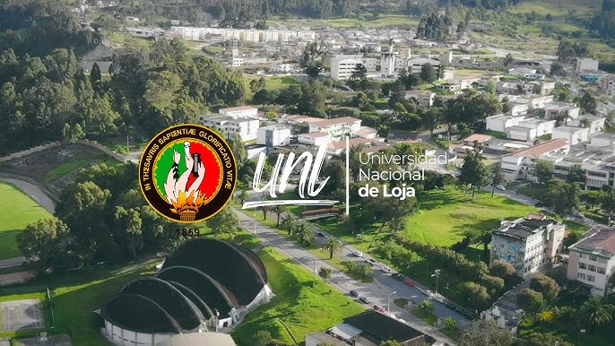

# 💻 **PORTAFOLIO DIGITAL DE APRENDIZAJE**  
## 🧠 **TEORÍA DE LA PROGRAMACIÓN**  
### 🏫 **Ciclo 1**

### ✍️ **Autor:**  
## *Ricardo Mathias Ochoa Armijos*  

📍 Universidad Nacional de Loja — Loja, Ecuador*  
📅 *Septiembre 2025 -  Febrero 2026*

### 🔗 **Accede al Portafolio Completo**  
[👉 Entrar al Portafolio](index.md)

